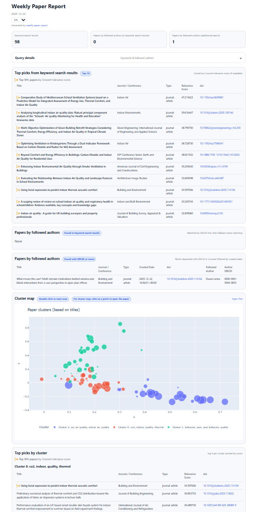
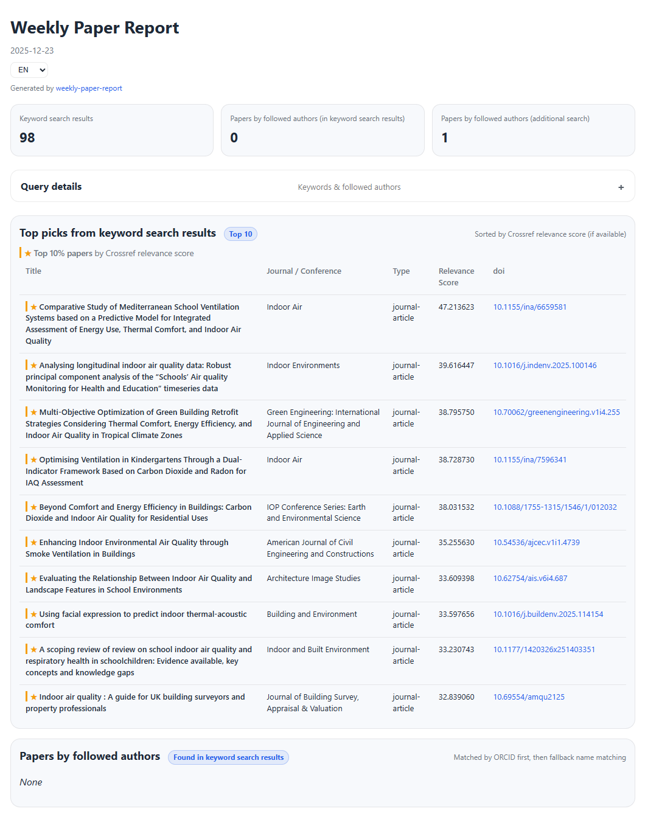
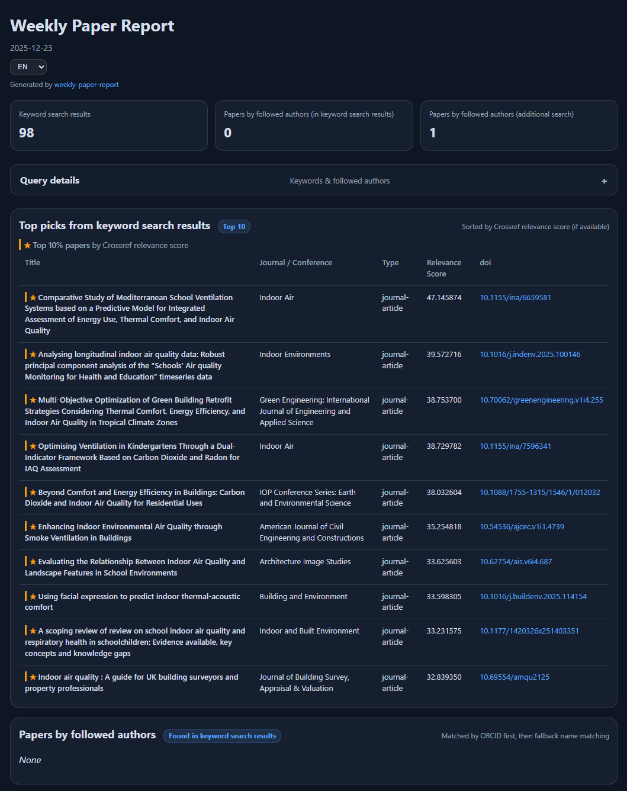
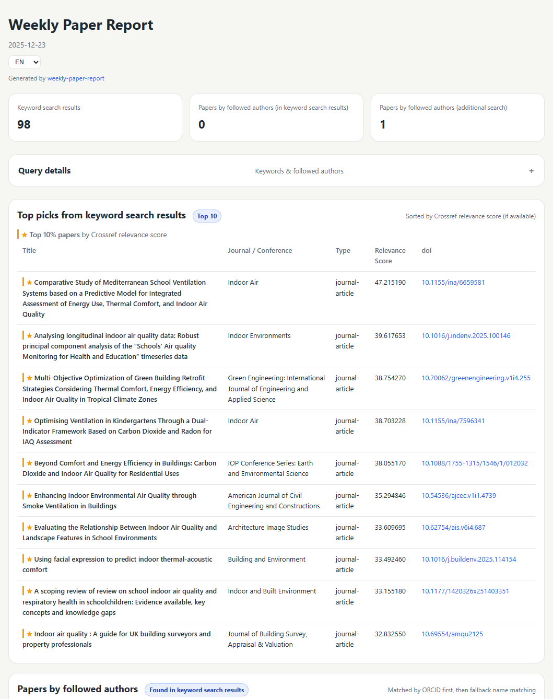
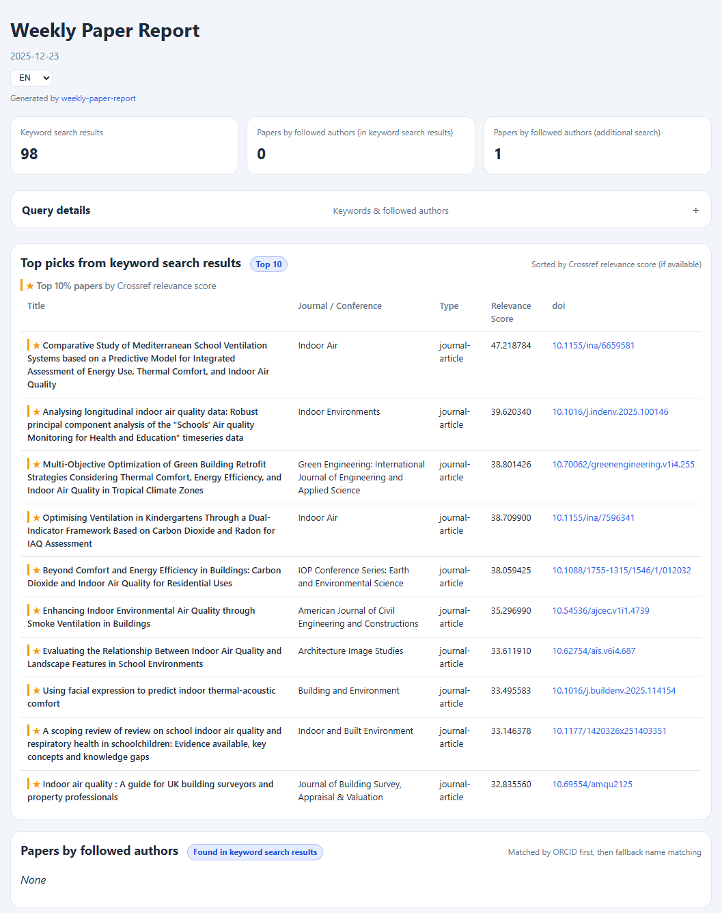

# Weekly Paper Report

&nbsp;
&nbsp;

> 🔄 Automatically updated every Monday via GitHub Actions
> 
> 🌐 Live demo: https://hqrrr.github.io/weekly-paper-report/

[📘 中文文档](README_CN.md)

## About this tool

**Weekly Paper Report** is an **automated weekly academic paper monitoring and visualization tool**. It automatically retrieves the latest papers from *Crossref* based on keywords and authors of interest (supports ORCID), generating a static HTML report that can be directly published to GitHub Pages.

This tool is ideal for:
- Tracking the latest literature in specific research areas
- Monitoring recent publications by particular scholars
- Quickly grasping the distribution and trends of research topics within a week

## Overview

<!-- TOC -->
* [Weekly Paper Report](#weekly-paper-report)
  * [About this tool](#about-this-tool)
  * [Overview](#overview)
  * [Key features](#key-features)
  * [Demo](#demo)
  * [How to use](#how-to-use)
    * [1) Fork & enable GitHub Actions](#1-fork--enable-github-actions)
    * [2) Configure GitHub Pages](#2-configure-github-pages)
    * [3) Configure your keywords and followed authors](#3-configure-your-keywords-and-followed-authors)
    * [4) (Recommended) Set `WPR_MAILTO` as a GitHub Actions secret](#4-recommended-set-wpr_mailto-as-a-github-actions-secret)
  * [How the "Cluster map" works](#how-the-cluster-map-works)
  * [Responsible use and limitations](#responsible-use-and-limitations)
  * [Customizing the report theme](#customizing-the-report-theme)
    * [Using an existing theme](#using-an-existing-theme)
    * [Adding a new theme](#adding-a-new-theme)
  * [Local development](#local-development)
  * [License](#license)
<!-- TOC -->

## Key features

- **Automated weekly literature monitoring:** 

    Automatically queries recent publications (rolling time window, default: 7 days) based on user-defined keywords and followed authors.

- **Crossref-based search with ORCID support:** 

    Uses the Crossref API for open bibliographic data retrieval and supports author tracking via ORCID identifiers.

- **Keyword-driven relevance ranking:** 

    Results are ranked by Crossref relevance score, helping surface the most relevant papers first.

- **Topic clustering of search results:** 

    Applies TF-IDF-based clustering on paper titles to group results into thematic clusters and highlight key research directions.

- **Self-contained static HTML report:** 

    Outputs a fully self-contained report (`index.html` + assets) that can be hosted on GitHub Pages or shared offline.

- 🆕 **Paper title translation:**

    Paper titles shown in the report are now automatically translated using the DeepL API. Translation is disabled automatically if no API key is provided. A free DeepL API key is available from the [official DeepL website](https://developers.deepl.com/docs/getting-started/intro), with a monthly quota of **500,000 characters**, which is typically sufficient for a weekly paper report.

[Back to top ↥](#overview)

## Demo

An example weekly report is available at:  
👉 [Weekly Paper Report](https://hqrrr.github.io/weekly-paper-report/)

<!-- REPORT_UPDATE_START -->
🕒 Last report update: **2025-12-26 22:05**
<!-- REPORT_UPDATE_END -->



[Back to top ↥](#overview)

## How to use

### 1) Fork & enable GitHub Actions

1. Fork this repository to your own GitHub account.
2. Open your fork -> **Actions** tab -> enable workflows if GitHub asks you to  
   (**scheduled workflows are often disabled by default on forks**).

### 2) Configure GitHub Pages

In your fork:
1. Go to **Settings -> Pages**
2. Set **Source** to **GitHub Actions**
3. After the workflow finishes, your report will be published to your GitHub Pages site.
4. (Optional) Trigger a manual run once: **Actions -> Build and Deploy Report to GitHub Pages -> Run workflow**, to verify everything works.

> **Where to find your report (GitHub Pages URL)**
> 
> After the workflow has finished successfully, your report will be available at:
> 
> ```
> https://<your-github-username>.github.io/<repository-name>/
> ```
>
> You can also find the exact URL in:
> - **Settings -> Pages** (shown under "Your site is live at …"), or
> - the **Deployments** page (shown under "github-pages").


### 3) Configure your keywords and followed authors

Edit these files in your fork (examples see below):
- `./config/keywords.yaml` - keywords used for Crossref search
- `./config/followed_authors.yaml` - followed authors (recommended: include ORCID)

Commit and push the changes to your default branch to regenerate the report.

1. Example: `keywords.yaml`

```yaml
# List of keywords used for literature search
keywords:
  - indoor environmental quality
  - IEQ
  - thermal comfort
  - indoor air quality
  - user behavior
```
> Each keyword is queried against Crossref. 
> Use full terms and common abbreviations where appropriate.

2. Example: `followed_authors.yaml`

```yaml
# List of followed authors
authors:
  - name: Andrew Persily
    orcid: "0000-0002-9542-3318"
    names:
      - Andrew Persily
      - A. Persily
```

> - `name` is used for display and matching in keyword search results.
> - `orcid` enables precise author-based lookup via Crossref and is **strongly recommended**. 
> - If `orcid` is not provided, the author will only be matched against keyword search results
  using the names listed in `names`. In this case, author-based lookup via Crossref
  is not performed and results may be incomplete.

### 4) (Recommended) Set `WPR_MAILTO` as a GitHub Actions secret

Crossref recommends providing a contact email (`mailto`) for polite API usage.

In your fork:
1. Go to **Settings -> Secrets and variables -> Actions**
2. Create a new **Repository secret**:
   - Name: `WPR_MAILTO`
   - Secret: your email address

### 5) (Optional) Set `TRANSLATION_DEEPL_API_KEY` as a GitHub Actions secret

You may also get a free DeepL API key from [DeepL](https://developers.deepl.com/docs/getting-started/intro) to configure for translating the paper title.

In your fork:
1. Go to **Settings -> Secrets and variables -> Actions**
2. Create a new **Repository secret**:
   - Name: `TRANSLATION_DEEPL_API_KEY`
   - Secret: your DeepL API key

> **Weekly schedule notes (important)**
> - The workflow is configured to run on a weekly schedule (via `on: schedule`).
> - **GitHub may automatically disable scheduled runs for repositories with no activity for ~60 days.**
> 
> > This repository performs a small automated update on each run to keep the scheduled workflow active.
> 
> If your weekly updates stop, simply:
> - make a small commit (e.g., edit README), and/or
> - re-enable the workflow in the **Actions** tab.

> **About the update schedule**
>
> The update frequency of this report is defined in the GitHub Actions workflow file  
> (`.github/workflows/update_github_pages.yml`).
>
> The workflow is currently scheduled to run once per week at a fixed time (UTC),
> as defined in the `on: schedule` cron configuration:
>   ```
>    # every Monday at 02:00 UTC
>    # German time: 03:00 in winter / 04:00 in summer
>    # China time: 10:00
>    - cron: "0 2 * * 1"
>   ```
> 
> If you would like to change the update frequency or execution time,
> you can edit the `on: schedule` (cron) section accordingly.


[Back to top ↥](#overview)

## How the "Cluster map" works

This **Weekly Paper Report** tool groups papers into rough "topics" based on their titles (not abstracts), by following steps:

1. Text preprocessing + stop words: Weekly Paper Report vectorizes paper titles with TF-IDF and removes:
   1. scikit-learn's built-in English stop words 
   2. additional domain stop words (e.g., "study", "method", "analysis", "model", "energy", "system", ...), see `stop_words.py` (you may customize your own stop words).
   3. `ngram_range = (1, 2)` (unigrams + bigrams)
2. Two clustering methods are tried:
   1. **K-Means**: For each *k* ∈ {3,4,5,6,7}, compute cosine silhouette score. Pick the smallest *k* whose silhouette is within a small margin of the best score (preference for simpler clustering).
   2. **HDBSCAN**: First reduce TF-IDF with TruncatedSVD (default: 100 components) and L2-normalize vectors. Then run HDBSCAN with min_cluster_size = 5.
3. For each candidate clustering, compute:
   1. cosine silhouette (computed on non-noise points for HDBSCAN)
   2. number of clusters (excluding noise)
   3. noise ratio (fraction of points labeled `-1`)
   4. min cluster size, max cluster share (to detect overly imbalanced solutions)
4. Choosing the "best" clustering result. Select the final clustering with a pragmatic rule:
   1. Reject overly noisy results: if HDBSCAN labels too many points as noise (default `noise_ratio > 0.30`), it won’t be selected.
   2. Compare cosine silhouette:
      1. HDBSCAN must outperform K-Means by a small margin (default `+0.03`) to win.
      2. Otherwise, default to K-Means (more stable and assigns all papers).

## Responsible use and limitations

This project is intended as a **lightweight literature monitoring and exploration tool**.  
Please consider the following points when using or extending it:

- **Avoid excessive request frequency**

  Do not configure very short update intervals (e.g., hourly or daily runs). Excessive automated requests may violate the fair-use expectations of public APIs such as Crossref. A weekly schedule is strongly recommended.

- **Results may be incomplete**

  The report relies on open bibliographic metadata and keyword-based queries. Not all relevant publications may be indexed, linked, or returned by the data sources. Absence of a paper in the report does not imply absence in the literature.

- **Author matching is imperfect**
  
  Author-based tracking is most reliable when ORCID identifiers are available. Name-based matching may produce false positives or miss relevant works.

- **Clustering and ranking are heuristic**
  
  Topic clustering and relevance ranking are automatically derived from titles and metadata using statistical methods. These results are approximate and should be interpreted as exploratory aids rather than authoritative classifications.

- **Not a substitute for systematic review**
  
  This tool is designed to support awareness and discovery, not to replace systematic literature reviews or expert judgment.

Users are encouraged to treat the generated reports as **decision-support material**
and to verify important findings through primary sources.

[Back to top ↥](#overview)

## Customizing the report theme

The visual appearance of the report is controlled by a CSS theme.

### Using an existing theme

By default, the report uses the `light` theme.  
You can select a theme when generating the report in `app.py`:

```python
# app.py
## Report theme
THEME = "light"
```

Available themes are loaded from the `themes/` directory.

|                     Light                      |                     Dark                      |                     Paper Light                      |                     Soft Blue                      |
|:----------------------------------------------:|:---------------------------------------------:|:----------------------------------------------------:|:--------------------------------------------------:|
|  |  |  |  |


### Adding a new theme

To add a custom theme:

1. Copy an existing theme file, for example: `themes/light.css -> themes/dark.css`
2. Modify the CSS styles in the new file
3. Set the theme name accordingly in `app.py`: `THEME = "dark"`

> If the specified theme name cannot be found, the report will automatically fall back to the default `light` theme.

[Back to top ↥](#overview)

## Local development

You can also generate the report locally without GitHub Actions:

1. Clone the repository:
    ```
    git clone https://github.com/hqrrr/weekly-paper-report.git
    cd weekly-paper-report
    ```
2. Create and configure `.env` file (for local runs):
    ```
    # .env
    WPR_MAILTO=youremail@example.com
    TRANSLATION_DEEPL_API_KEY=your.deepl.api.key
    ```
3. Install dependencies: `pip install -r requirements.txt`
4. Run the weekly paper report app: `python app.py`
5. Open the generated report in a browser: `./report/index.html`

> The local workflow is equivalent to the GitHub Actions workflow, except that secrets are provided via `.env`.

[Back to top ↥](#overview)

## License

This project is licensed under the **MIT License**. See the [LICENSE](./LICENSE) file for details.

The generated reports and retrieved bibliographic metadata are subject to the terms of their respective data providers.

[Back to top ↥](#overview)
