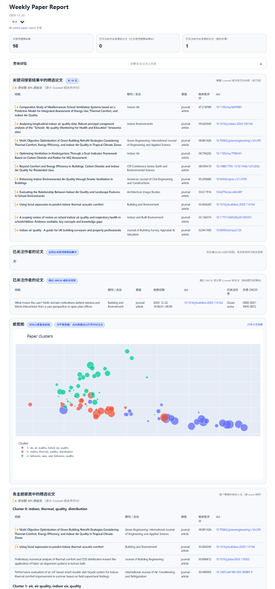

# Weekly Paper Report（每周论文报告）

&nbsp;
&nbsp;

> 🔄 通过 GitHub Actions 每周一自动更新  
> 🌐 在线示例：https://hqrrr.github.io/weekly-paper-report/

[📘 English README](README.md)

## 关于本工具

**Weekly Paper Report** 是一个**自动化的每周学术论文监测与可视化工具**。它基于关键词与关注作者（支持 ORCID），自动从 *Crossref* 获取最新论文，
并生成一个可直接发布到 GitHub Pages 的静态 HTML 报告。

该项目适合用于：
- 跟踪特定研究方向的最新文献
- 关注某些学者的近期发表情况
- 快速了解一周内的研究主题分布与趋势

## 概览

<!-- TOC -->
* [Weekly Paper Report（每周论文报告）](#weekly-paper-report每周论文报告)
  * [关于本工具](#关于本工具)
  * [概览](#概览)
  * [主要特性](#主要特性)
  * [示例](#示例)
  * [使用方法](#使用方法)
    * [1）Fork 仓库并启用 GitHub Actions](#1fork-仓库并启用-github-actions)
    * [2）配置 GitHub Pages](#2配置-github-pages)
    * [3）配置关键词与关注作者](#3配置关键词与关注作者)
    * [4）（推荐）设置 `WPR_MAILTO`](#4推荐设置-wpr_mailto)
  * [Cluster map 聚类图工作原理](#cluster-map-聚类图工作原理)
  * [负责任的使用与局限性](#负责任的使用与局限性)
  * [自定义报告主题](#自定义报告主题)
    * [使用已有主题](#使用已有主题)
    * [添加新主题](#添加新主题)
  * [本地开发](#本地开发)
  * [许可证](#许可证)
<!-- TOC -->

## 主要特性

- **自动化的每周文献监测**  
  
    根据用户定义的关键词和关注作者，自动查询最近 7 天内的新发表论文。

- **基于 Crossref 的开放数据检索（支持 ORCID）**

    使用 Crossref API 获取开放书目数据，并通过 ORCID 精确追踪作者。

- **相关性排序**

    利用 Crossref 提供的相关性评分，对检索结果进行排序。

- **主题聚类分析（Cluster map）**

    基于论文标题的 TF-IDF 向量与聚类算法，将论文分组为若干主题。

- **无需外部依赖的的静态 HTML 报告**

    生成的报告无需外部服务器，可直接部署到 GitHub Pages 或离线查看。

- 🆕 **论文标题翻译：**

    报告中展示的论文标题现已支持通过 DeepL API 自动翻译。若未提供 API key，该功能将自动禁用。可从 [DeepL 官方网站](https://developers.deepl.com/docs/getting-started/intro) 获取免费的 DeepL API key，免费方案每月提供 **500,000 个字符**的翻译额度，通常已足够用于每周一次的论文周报生成。


[返回顶部 ↥](#概览)

## 示例

在线示例：  
👉 [Weekly Paper Report](https://hqrrr.github.io/weekly-paper-report/)



[返回顶部 ↥](#概览)

## 使用方法

### 1）Fork 仓库并启用 GitHub Actions

1. 将仓库 Fork 到你自己的 GitHub 账号。
2. 进入 Fork 后的仓库 -> **Actions** -> 启用工作流  
   （Fork 仓库中的定时任务默认通常是关闭的）。

### 2）配置 GitHub Pages

1. 进入 **Settings -> Pages**
2. 将 **Source** 设置为 **GitHub Actions**
3. 工作流完成后，报告会自动发布到 GitHub Pages
4. （可选）手动触发一次运行：**Actions -> Build and Deploy Report to GitHub Pages -> Run workflow**，以验证所有功能正常。

> **报告链接地址（GitHub Pages 网址）**
> 
> 工作流成功完成后，您的报告将发布于：
> 
> ```
> https://<你的GitHub用户名>.github.io/<仓库名称>/
> ```
>
> 你还可在以下位置找到具体网址：
> - **Settings -> Pages**（显示于 "Your site is live at …" 下方），或
> - **Deployments**页面（显示于 "github-pages" 下方）。

### 3）配置关键词与关注作者

编辑以下文件：

- `config/keywords.yaml`：检索关键词
- `config/followed_authors.yaml`：关注作者（强烈建议填写作者的 ORCID）

1. 示例（`keywords.yaml`）：

```yaml
keywords:
  - indoor environmental quality
  - IEQ
  - thermal comfort
  - indoor air quality
  - user behavior
```

2. 示例（`followed_authors.yaml`）：

```yaml
authors:
  - name: Andrew Persily
    orcid: "0000-0002-9542-3318"
    names:
      - Andrew Persily
      - A. Persily
```

> - `name` 用于显示及关键词搜索结果的匹配。
> - `orcid` 可通过 Crossref 实现精确的作者检索，**强烈建议**填写。
> - 若未提供 `orcid`，系统仅会根据 `names` 中列出的姓名将作者与关键词搜索结果进行匹配。此时不会通过 Crossref 进行作者检索，检索结果可能不完整。

### 4）（推荐）设置 `WPR_MAILTO`

Crossref 建议在 API 请求中提供联系邮箱。

在 **Settings -> Secrets and variables -> Actions** 中新增：

- Name：`WPR_MAILTO`
- Secret：你的邮箱地址

### 5)（可选）设置 `TRANSLATION_DEEPL_API_KEY`

你也可以从 [DeepL 官方网站](https://developers.deepl.com/docs/getting-started/intro) 获取一个免费的 DeepL API key，用于配置论文标题的自动翻译功能。

在 **Settings -> Secrets and variables -> Actions** 中新增：
- Name：`TRANSLATION_DEEPL_API_KEY`
- Secret：你的 DeepL API key


> **关于每周调度的说明（重要）**
> - 该工作流被配置为按每周频率运行（通过 `on: schedule`）。
> - **如果仓库在约 60 天内没有任何活动，GitHub 可能会自动禁用定时运行。**
> 
> > 本仓库在每次运行时都会执行一次很小的自动化更新，
> > 以保持定时工作流处于激活状态。
> 
> 如果每周更新停止，请尝试以下操作：
> - 提交一个很小的改动（例如修改 README），以及/或
> - 在 **Actions** 页面中重新启用该工作流。

> **关于更新频率**
>
> 本报告的自动更新频率是在 GitHub Actions 的工作流文件中定义的  
>（`.github/workflows/update_github_pages.yml`）。
>
> 当前工作流被配置为在固定的每周时间（UTC）自动运行，
> 具体时间由 `on: schedule` 的 cron 配置决定：
>   ```
>    # 每周一 02:00（UTC）
>    # 德国时间：冬令时 03:00 / 夏令时 04:00
>    # 中国时间：10:00
>    - cron: "0 2 * * 1"
>   ```
> 
> 如需修改更新频率或执行时间，
> 可相应编辑该文件中的 `on: schedule`（cron）配置。

[返回顶部 ↥](#概览)

## Cluster map 聚类图工作原理

**Weekly Paper Report**通过以下步骤，根据论文标题（而非摘要）将论文归类为大致“主题”：

1. 文本预处理 + 停用词处理：周刊论文报告使用TF-IDF对论文标题进行向量化处理，并移除：
   1. scikit-learn内置英语停用词
   2. 领域专用停用词（如“研究”、“方法”、“分析”、“模型”、‘能源’、“系统”等），详见`stop_words.py`（你也可以自定义停用词）。
2. `ngram_range = (1, 2)`（单词+双词组合）
3. 尝试两种聚类方法：
   1. **K-Means**：对每个 *k* ∈ {3,4,5,6,7} 计算余弦轮廓得分（cosine silhouette score）。若多个 *k* 的表现相近，则优先选择聚类数量更少的方案，以获得更简洁、稳定的结果。
   2. **HDBSCAN**：先用 TruncatedSVD（默认100个成分）降维 TF-IDF 向量并进行L2范数归一化，再以min_cluster_size=5运行HDBSCAN。
4. 对每个候选聚类结果计算：
   1. 余弦轮廓 cosine silhouette score（HDBSCAN需基于非噪声点计算）
   2. 聚类数量（排除噪声点）
   3. 噪声比率（标记为`-1`的点占比）
   4. 最小聚类规模、最大聚类覆盖率（用于检测过度失衡的解）
5. 选择“最佳”聚类结果。采用实用规则确定最终聚类方案：
   1. 剔除过度噪声结果：若 HDBSCAN 标记过多点为噪声（默认`noise_ratio > 0.30`），则不予采用。
   2. 比较余弦轮廓系数：
         1. HDBSCAN需以微弱优势（默认`+0.03`）胜过 K-Means 方可胜出。
         2. 否则默认采用K均值法（更稳定且能分配所有论文）。

[返回顶部 ↥](#概览)

## 负责任的使用与局限性

本项目旨在作为一个**轻量级的文献监测与探索工具**。在使用或扩展本工具时，请注意以下几点：

- **避免过高的请求频率**

  请勿配置过短的更新间隔（例如每小时或每日运行）。过于频繁的自动化请求可能违反 Crossref 等公共 API 的合理使用（fair-use）预期。强烈建议采用每周一次的更新频率。

- **结果可能不完整**

  报告基于开放的书目元数据以及关键词检索生成。并非所有相关出版物都会被数据源索引、关联或返回。报告中未出现某篇论文，并不意味着该论文在文献中不存在。

- **作者匹配并非完全准确**
  
  当提供 ORCID 标识符时，基于作者的跟踪最为可靠。基于姓名的匹配可能产生误匹配（false positives），或遗漏相关工作。

- **聚类与排序具有启发式性质**
  
  主题聚类与相关性排序是基于论文标题元数据，通过统计方法自动生成的。这些结果具有近似性，应被视为探索性辅助工具，而非权威性的分类结果。

- **不能替代系统性综述**
  
  本工具旨在辅助研究动态的了解与文献发现，并非用于替代系统性文献综述或专家判断。

建议本工具用户将生成的报告视为**决策支持材料**，并通过原始文献对重要结论进行核实。

[返回顶部 ↥](#概览)

## 自定义报告主题

报告的视觉外观由 CSS 主题控制。

### 使用已有主题

默认情况下，报告使用 light 主题。  
你可以在生成报告时，在 `app.py` 中选择主题：

```python
# app.py
## Report theme
THEME = "light"
```

可用主题将从 `themes/` 目录中加载。

|                     Light                      |                     Dark                      |                     Paper Light                      |                     Soft Blue                      |
|:----------------------------------------------:|:---------------------------------------------:|:----------------------------------------------------:|:--------------------------------------------------:|
|  |  |  |  |


### 添加新主题

要添加一个自定义主题：

1. 复制一个已有主题文件，例如： `themes/light.css -> themes/dark.css`
2. 修改新文件中的 CSS 样式
3. 在 `app.py` 中相应地设置主题名称：`THEME = "dark"`

> 如果指定的主题名称未找到，报告将自动回退到默认的 `light` 主题。

[返回顶部 ↥](#概览)

## 本地开发

你也可以在不使用 GitHub Actions 的情况下，在本地生成报告：

1. 克隆本仓库：
    ```
    git clone https://github.com/hqrrr/weekly-paper-report.git
    cd weekly-paper-report
    ```
2. 创建并配置 `.env` 文件（用于本地运行）：
    ```
    # .env
    WPR_MAILTO=youremail@example.com
    TRANSLATION_DEEPL_API_KEY=your.deepl.api.key
    ```
3. 安装依赖：`pip install -r requirements.txt`
4. 运行周报程序：`python app.py`
5. 在浏览器中打开生成的报告：`./report/index.html`

> 本地工作流程与 GitHub Actions 的工作流程类似，区别仅在于密钥（邮箱地址）通过 `.env` 文件提供。

[返回顶部 ↥](#概览)

## 许可证

本项目基于 MIT License 发布，详见 [LICENSE](./LICENSE) 文件。

生成的报告以及获取的书目元数据，均受其各自数据提供方使用条款的约束。

[返回顶部 ↥](#概览)
